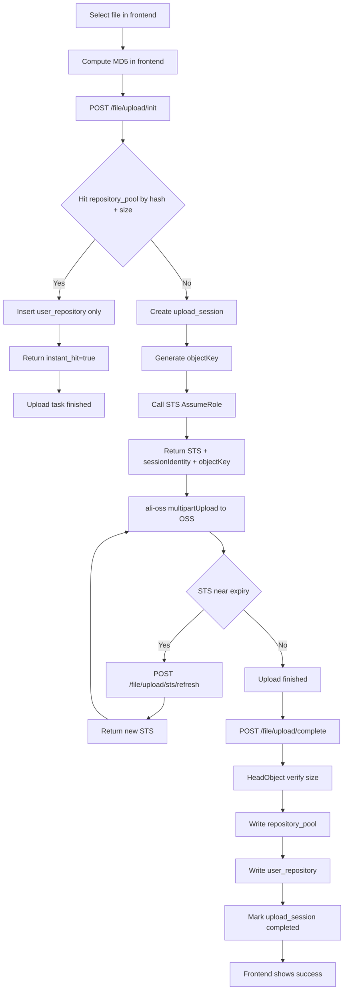
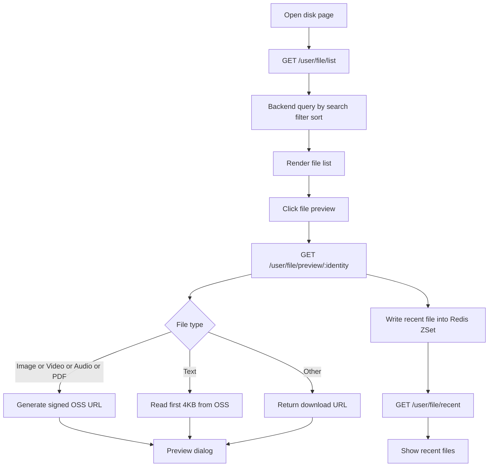
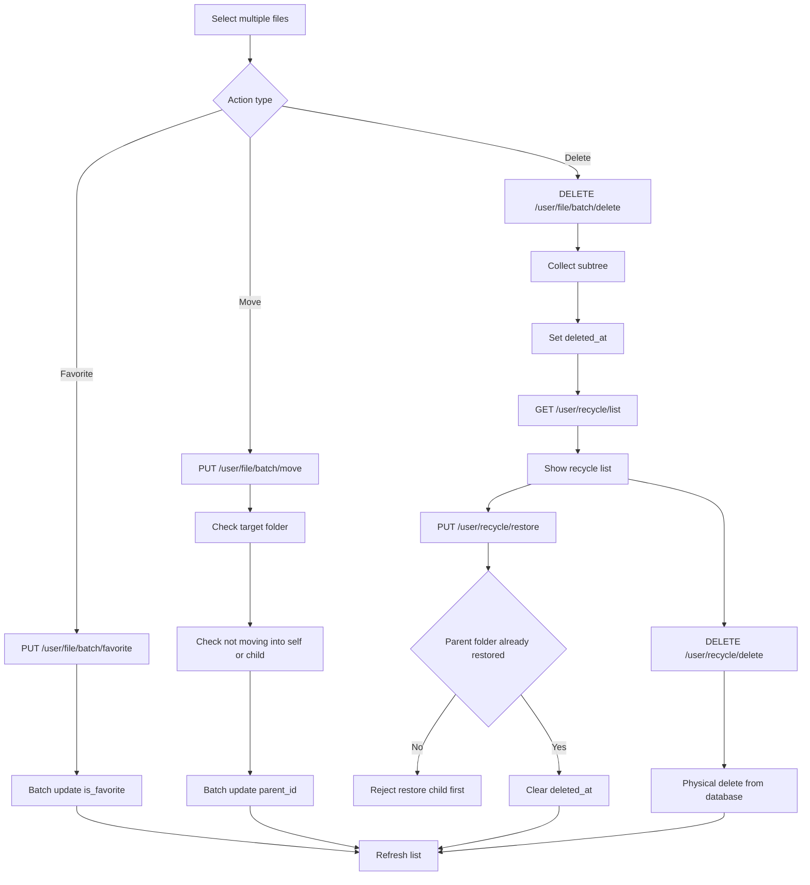

# Cloud Disk Feature Flow

## Upload Flow

```mermaid
flowchart TD
    A[Select file in frontend] --> B[Compute MD5 in frontend]
    B --> C[POST /file/upload/init]
    C --> D{Hit repository_pool by hash + size}

    D -- Yes --> E[Insert user_repository only]
    E --> F[Return instant_hit=true]
    F --> G[Upload task finished]

    D -- No --> H[Create upload_session]
    H --> I[Generate objectKey]
    I --> J[Call STS AssumeRole]
    J --> K[Return STS + sessionIdentity + objectKey]
    K --> L[ali-oss multipartUpload to OSS]

    L --> M{STS near expiry}
    M -- Yes --> N[POST /file/upload/sts/refresh]
    N --> O[Return new STS]
    O --> L

    M -- No --> P[Upload finished]
    P --> Q[POST /file/upload/complete]
    Q --> R[HeadObject verify size]
    R --> S[Write repository_pool]
    S --> T[Write user_repository]
    T --> U[Mark upload_session completed]
    U --> V[Frontend shows success]
```

## Preview And Recent Flow

```mermaid
flowchart TD
    A[Open disk page] --> B[GET /user/file/list]
    B --> C[Backend query by search filter sort]
    C --> D[Render file list]

    D --> E[Click file preview]
    E --> F[GET /user/file/preview/:identity]
    F --> G{File type}

    G -- Image or Video or Audio or PDF --> H[Generate signed OSS URL]
    G -- Text --> I[Read first 4KB from OSS]
    G -- Other --> J[Return download URL]

    H --> K[Preview dialog]
    I --> K
    J --> K

    F --> L[Write recent file into Redis ZSet]
    L --> M[GET /user/file/recent]
    M --> N[Show recent files]
```

## Batch And Recycle Flow

```mermaid
flowchart TD
    A[Select multiple files] --> B{Action type}

    B -- Favorite --> C[PUT /user/file/batch/favorite]
    C --> D[Batch update is_favorite]
    D --> Z[Refresh list]

    B -- Move --> E[PUT /user/file/batch/move]
    E --> F[Check target folder]
    F --> G[Check not moving into self or child]
    G --> H[Batch update parent_id]
    H --> Z

    B -- Delete --> I[DELETE /user/file/batch/delete]
    I --> J[Collect subtree]
    J --> K[Set deleted_at]
    K --> L[GET /user/recycle/list]
    L --> M[Show recycle list]

    M --> N[PUT /user/recycle/restore]
    N --> O{Parent folder already restored}
    O -- No --> P[Reject restore child first]
    O -- Yes --> Q[Clear deleted_at]
    Q --> Z

    M --> R[DELETE /user/recycle/delete]
    R --> S[Physical delete from database]
    S --> Z
```

